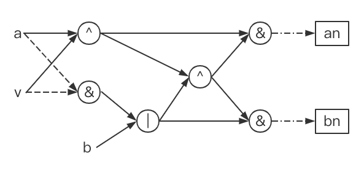
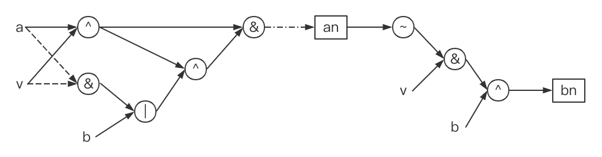
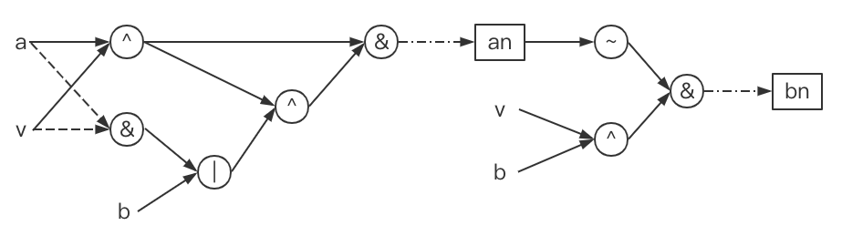

# LeetCode 137 只出现一次的数字 II

虽然要求不开辟额外空间与O(n)的时间复杂度, 单由于数据比较水. 靠排序依然能过, 所以花了点时间想了想

数字去重, 时间复杂度O(n)且不开辟额外空间, 那么就该从位运算入手了

某个元素只出现一次, 其余每个元素出现3个, 则把每一个数字拆分为二进制, 经过拆分求和之后每一位上只有`3x`或`3x + 1`, 经过`%3`后就完成了去重工作

---

由此题意变成, 通过位运算设计`加法器`与`%3`操作的数字电路

由于最大数字为`3`, 至少需要`2bit`才能实现运算

设运算数的低位为`a`, 高位为`b`, 输入为`v`

每次计算结束时低位为`an`, 高位为`bn`

位运算符号使用c语言版本

至于具体设计, 就自由发挥了

以下示意图均为随手瞎画, 没有遵循任何数字电路图规范_(:з」∠)_



<center>方法一</center>



<center>方法二</center>



<center>方法三</center>

---

由于`an`的推导基本是一样的, 这里只列出`an`部分的推导

将图转化为等式

```
c = a ^ v
d = a & v
e = b | d
f = c ^ e
```

```
an = c & f
bn = e & f
```

```
an = c & f
   = c & (c^e)
   = c & (~e)
   = c & (~(b|d))
   = (a^v) & (~b) & (~d)
   = (a^v) & (~b) & (~(a&v))
   = (a^v) & (~b) & (a|v)
   = (a^v) & (~b)
```